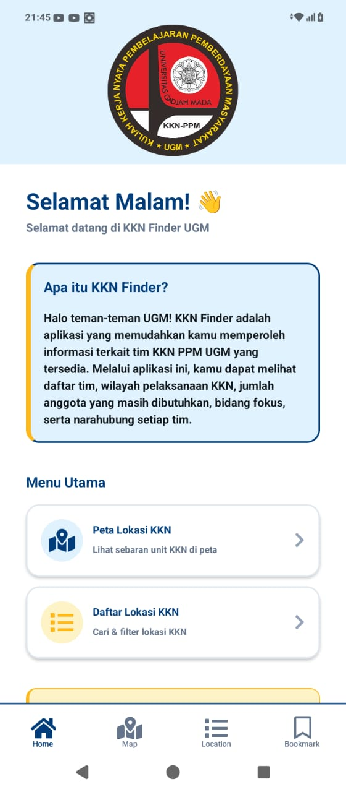
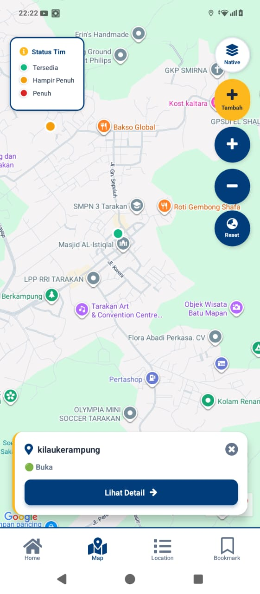
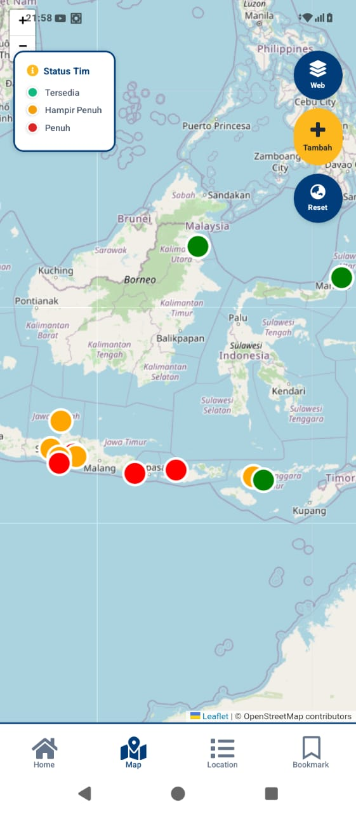
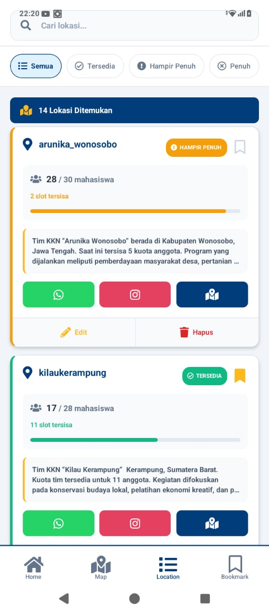
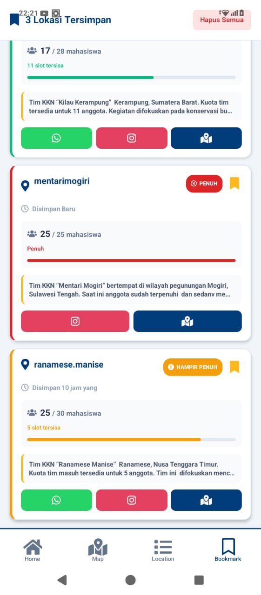

# KKN Finder App

## 📌 Nama Produk

**KKN Finder**

---

## 📄 Deskripsi Produk

**KKN Finder** adalah aplikasi mobile berbasis **React Native (Expo)** yang dirancang untuk membantu mahasiswa Universitas Gadjah Mada (UGM) dalam mencari, melihat, dan mengelola informasi lokasi KKN.

Aplikasi ini menyediakan:

* Visualisasi persebaran lokasi KKN melalui **peta interaktif**
* Daftar lengkap lokasi KKN dalam bentuk **list**
* Fitur **pencarian dan filter status lokasi**
* Sistem **bookmark (simpan lokasi favorit)**
* Fitur **tambah, edit, dan hapus lokasi KKN**
* Akses langsung ke **Google Maps, WhatsApp, dan Instagram**

Aplikasi ini terhubung ke **Firebase Realtime Database** sebagai basis data utama.

---

## 🧩 Komponen Pembangun Produk

### 1. Framework & Library

* **React Native (Expo)**
* **Expo Router (Tabs Navigation)**
* **Firebase Realtime Database**
* **React Native Maps**
* **Async Storage**
* **Leaflet (OpenStreetMap via WebView)**
* **TypeScript (TSX)**

---

### 2. Struktur Halaman (File TSX)

| File                     | Fungsi                    |
| ------------------------ | ------------------------- |
| `app/_layout.tsx`        | Kerangka utama aplikasi   |
| `app/(tabs)/_layout.tsx` | Navigasi bottom tab       |
| `home.tsx`               | Halaman utama / dashboard |
| `lokasi.tsx`             | Peta persebaran lokasi    |
| `listlokasi.tsx`         | Daftar lokasi KKN         |
| `bookmark.tsx`           | Lokasi yang disimpan      |
| `forminputlocation.tsx`  | Form input lokasi         |      |

---

### 3. Komponen UI

* `ThemedView`
* `ThemedText`
* `IconSymbol`
* `ParallaxScrollView`
* `MapView` dan `Marker`
* `WebView (Leaflet)`
* `SectionList`
* `TouchableOpacity`

---

## 🗄️ Sumber Data

Data lokasi KKN disimpan dan diambil dari:

**Firebase Realtime Database**

Node utama:

```
points/
```

Struktur data contoh:

```
{
  "name": "Desa X",
  "latitude": -7.79,
  "longitude": 110.36,
  "status": "open",
  "quota": 10,
  "description": "Lokasi KKN UGM",
  "contact": "08xxxxxxxx"
}
```

Data bookmark disimpan di:

```
AsyncStorage (local storage perangkat)
```

## 📸 Tangkapan Layar Aplikasi

### 1. Halaman Home


---

### 2. Halaman Peta Lokasi - Native


---

### 3. Halaman Peta Lokasi - Web


---

### 4. Halaman List Lokasi


---

### 5. Halaman Bookmark



## ▶️ Cara Menjalankan Aplikasi

1. Install dependencies

```bash
npm install
```

2. Jalankan aplikasi

```bash
npx expo start
```

3. Scan QR Code dengan **Expo Go**

---

## 👤 Pengembang

Nama: **Arum Pradana Cahyani Putri**
NIM: 23/514595/SV/22387
Proyek: Aplikasi Pencarian Lokasi KKN UGM
Tahun: 2025
